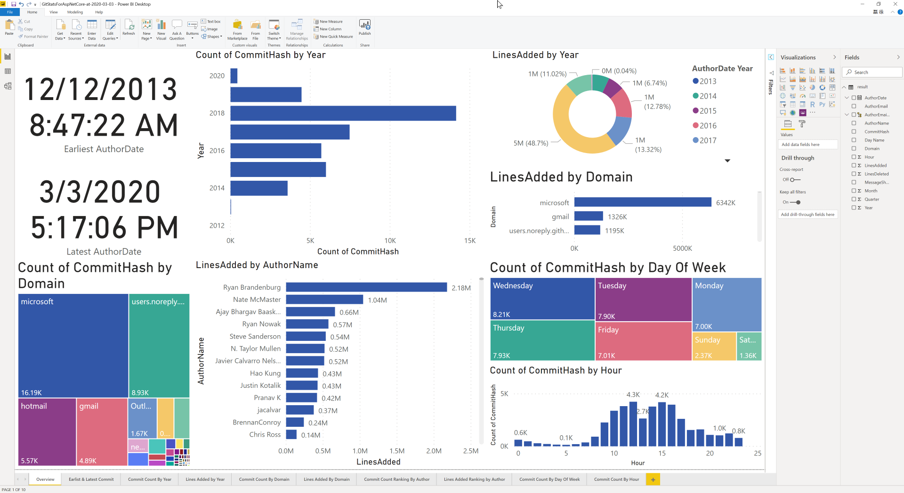
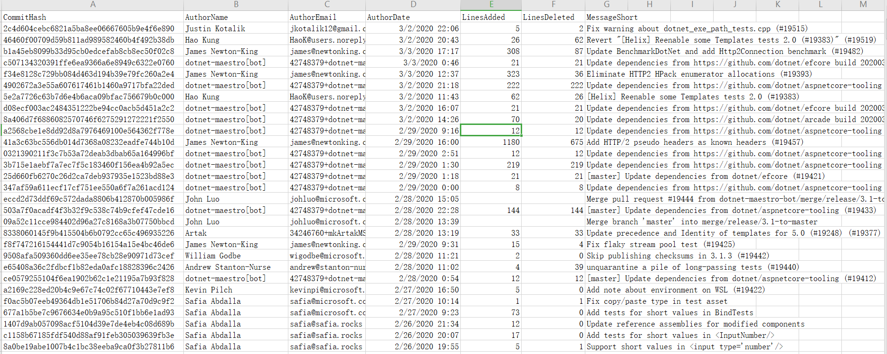

# DotNet GitStats


DotNet GitStats is a toolkit to build code statistic for git, it's built on top of libgit2 using DotNet. DotNet GitStats provide cross-platform command line tools that can be run on Windows, MacOS and Linux.

You can use this tool to generate a CSV file which can ben consumed easily using Excel, Power BI and any other data process tools. A sample Power BI report is provided with the repo.



## How it works

[libgit2sharp](https://github.com/libgit2/libgit2sharp) is a wonderful tool, it expose every git operation interface to DotNet and Mono which makes DotNet GitStats possible.

DotNet GitStats use [libgit2sharp](https://github.com/libgit2/libgit2sharp) to extract `git log` information and calculate line changes between commits, for example, lines added and lines deleted.

For ease of use, CVS or JSON formats are supported for you to analyze or visualize.

## Supported Platform

- Windows
- Linux
- MacOS

## Usage

```bash
# windows
./DotNetGitStats.exe -d <local repo dir> -o <output file path>

# linux
./DotNetGitStats -d <repo dir> -o <output path>

# maxOS
./DotNetGitStats -d <repo dir> -o <output path>
```

## Example

```bash
# get a csv result file
./DotNetGitStats.exe -d repos\BoatHouse -o result.csv

# get a json result file
./DotNetGitStats.exe -d repos\BoatHouse -o result.json
```

## Data Columns Provided in Output File

- `CommitHash` current git comit id
- `AuthorName`  current commit's author name
- `AuthorEmail` current commit's author email
- `MessageShort` current commit's msg in short line format
- `AuthorDate` commit.Author.When.DateTime
- `LinesAdded` numbers of line added compared with parent commit
- `LinesDeleted` numbers of line added  compared with parent commit

## Generated File Sample



## Roadmap

DotNet GitStats is still at very early stage, please feel free to support issue or PR. Here are some ideas we are exploring down the track.

- [x] Set up Github action for CI
- [x] Add README content
- [x] Create Power BI report using csv file
